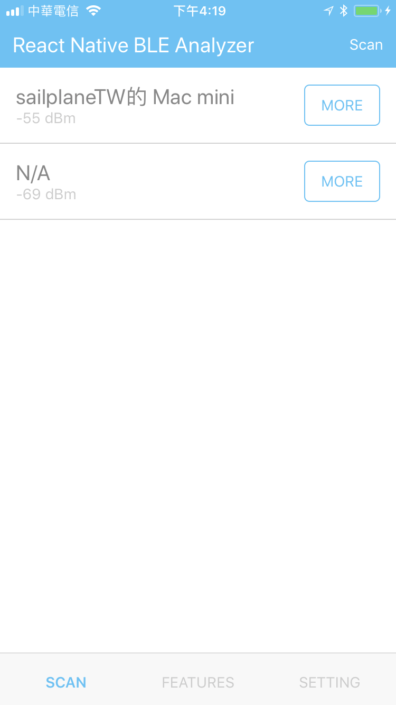
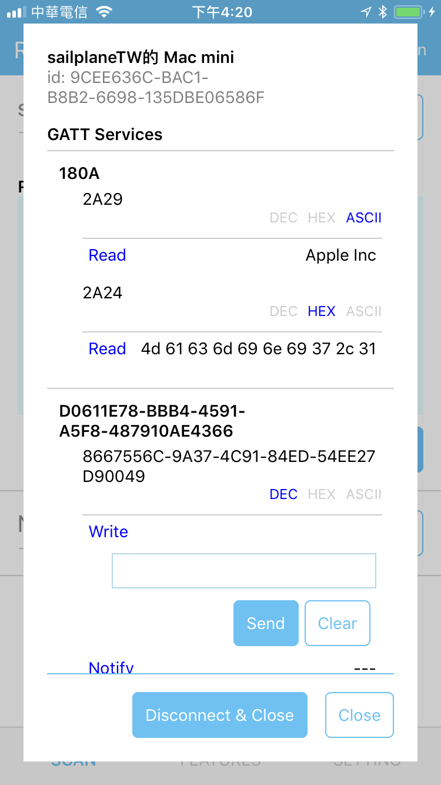
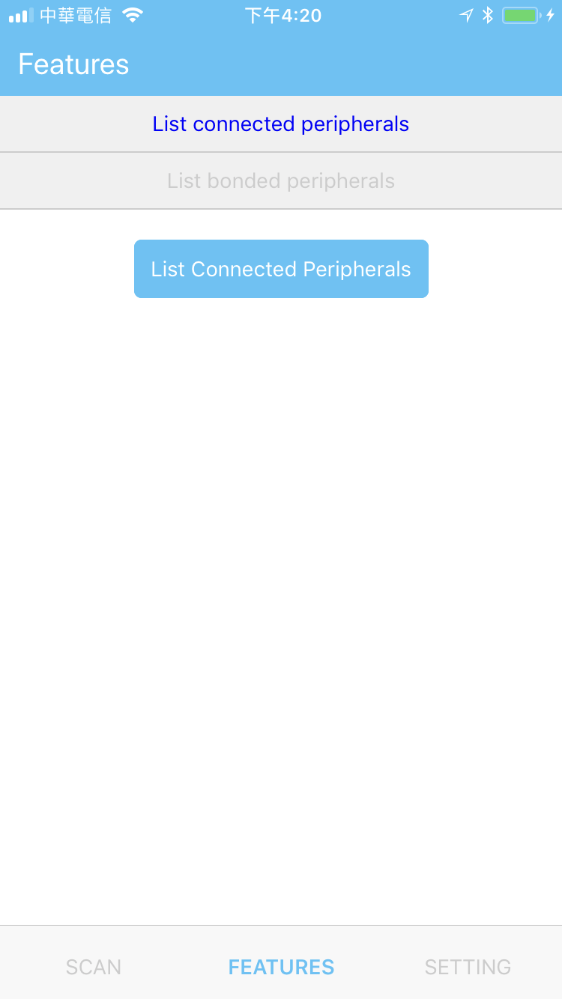
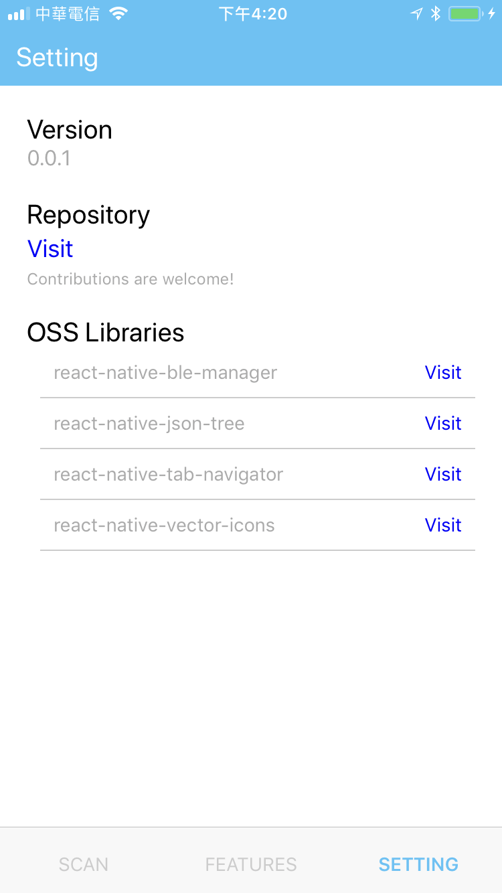

# react-native-ble-analyzer

Open source BLE analysis app for iOS and Android, built with React Native.

**Contributions are super welcome!**

## Why

Since we love both **React Native** and **BLE** technologies, we like to build an **general purpose tool** combining them. We also think we can learn more **BLE** stuff by building an app like this! 

## How

### Minimal dependencies
We try to limit the dependencies and focus on **React Native** and **BLE** themself, so in this app we don't use any UI component library as well as state management library (that's right, I'm talking about even `redux`).

### Respect BLE tech
Besides, we also try to split our components according to `BLE`'s terminology, which means we have corresponding `GattService`, `GattChar` (for characteristic), `GattCharProp` (for characteristic properties), by respecting that we can have better understanding of `BLE` technology.

> You can think characteristic properties are somthing like the operations you can perform on some characteristic

### BLE Library

By the way, in this app we use [**react-native-ble-manager**](https://github.com/innoveit/react-native-ble-manager) as our core BLE library, since we're also contributing to it. In this way, we can **eat our own dog food**, and also easier to spot whether some bugs belong to library or app. It's pretty good, please go to the reop and check it out!

## Features

* Scan peripherals
* Connect to peripherals
* Read, write, subscribe to notifications
* Switch formats for characteristic value, including decimal, hex, and ascii.
* List current connected BLE devices

## Sceenshots

    
    
    
    
    

 

## Conclusion

That's it. Thanks for checking this repo, looking forward to your contributions!
